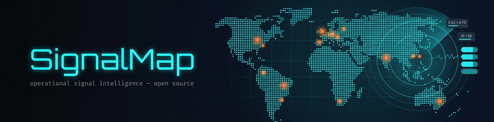
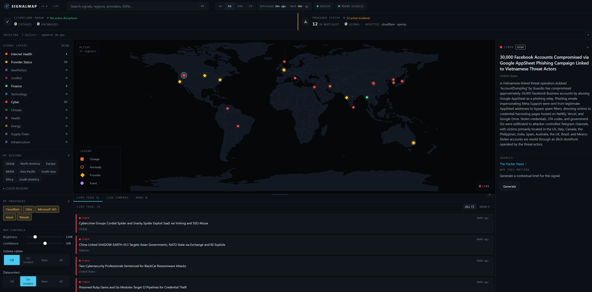
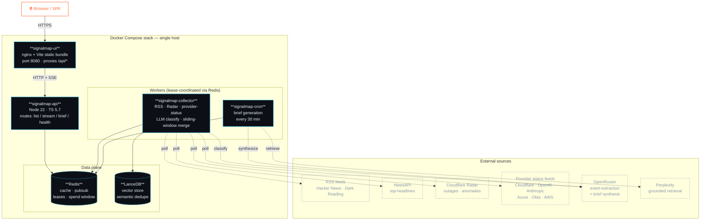

<p align="center">
  
</p>

<p align="center">
  <a href="https://github.com/malindarathnayake/SignalMap/releases/latest"></a>
  <a href="https://github.com/malindarathnayake/SignalMap/actions/workflows/release.yml"></a>
  <a href="https://github.com/malindarathnayake/SignalMap/pkgs/container/signalmap-node"></a>
  <a href="https://github.com/malindarathnayake/SignalMap/pkgs/container/signalmap-ui"></a>
  <a href="https://www.apache.org/licenses/LICENSE-2.0"></a>
  
  
  <a href="https://github.com/malindarathnayake/SignalMap/commits/main"></a>
</p>

<p align="center">
  <a href="./CHANGELOG.md"><strong>Changelog</strong></a> &middot;
  <a href="./deploy/README.md"><strong>Deploy guide</strong></a> &middot;
  <a href="https://github.com/malindarathnayake/SignalMap/issues"><strong>Issues</strong></a>
</p>

---

## What it does

SignalMap watches the public internet for **operational, security, geopolitical, and infrastructure events** — provider outages, network anomalies, cybersecurity incidents, supply-chain attacks — and surfaces them as a unified, geo-located, severity-ranked feed. It runs entirely on infrastructure you control.

SignalMap began as a fork of Worldmap / World Monitor. The application has since been substantially rewritten: the multi-variant desktop/map-layer product was replaced with a focused operational-signal workflow, a new Preact shell, server API/workers, and a redesigned SVG/D3 map experience.

- **Live map + feed** — every signal pinned to its geography, with category and severity colour-coding, server-sent updates as new events land.
- **Source-health visibility** — `/source-health-details` shows per-source fetch / accept / reject counts, last-fetched age, and a "why articles were skipped" panel that aggregates LLM confidence stats and dedupe reasons.
- **AI-classified news** — RSS items go through Distill (vendored) for clean article extraction, then through OpenRouter for structured event extraction with a confidence floor. Off-topic items (sports, lifestyle, marketing) are filtered out before the geocoder runs.
- **Sliding-window cache** — accepted events stay visible for 24h (configurable) even if the next collector tick rejects everything; a barren tick can no longer wipe the feed.
- **Cold-boot cost guard** — on a fresh container or wiped volumes the collector only classifies articles published in the last 6h (tunable), so backfill doesn't blow LLM budget.
- **Semantic dedupe** — accepted stories are embedded via OpenAI `text-embedding-3-small` (routed through your OpenRouter key, ~$0.01/month at typical volume) and stored in LanceDB; near-duplicate articles from different sources collapse into a single signal.
- **Brief generation** — periodic AI brief over the last 30 minutes of activity, with per-event drill-down. Perplexity for grounded retrieval, OpenRouter Sonnet for synthesis.
- **Provider status** — Cloudflare, OpenAI, Anthropic, Azure, Okta, AWS Lambda / RDS / S3 surfaced from their public status feeds.
- **Cloudflare Radar** — real-time outage incidents geocoded down to the datacenter. Cloudflare's own POPs map by IATA code; AWS regions like `me-central-1` map to the canonical datacenter city; ungrounded incidents fall back to country centroid (~250 countries) so they still render on the map.
- **Live health visibility** — `/api/signalmap/health` reports per-component status (Redis, LanceDB, collector, brief, OpenRouter, Perplexity) with last-call metrics and error classes. The UI's System Health panel reads it directly.

<p align="center">
  <a href=".github/Screenshot_4_1_1.png">
    
  </a>
  <br/>
  <sub><i>Map + live feed + inspector. Click for full resolution.</i></sub>
</p>

---

## Quick start (Docker Compose)

Pre-built images are published to GitHub Container Registry on every release. The deploy host needs Docker + Compose and ~2 GB RAM — no source checkout, no Node toolchain.

The two images:

```bash
docker pull ghcr.io/malindarathnayake/signalmap-node:latest
docker pull ghcr.io/malindarathnayake/signalmap-ui:latest
```

Five-service stack (`redis`, `signalmap-api`, `signalmap-collector`, `signalmap-cron`, `signalmap-ui`) is wired up in [`deploy/docker-compose.yml`](./deploy/docker-compose.yml). To bring it up:

```bash
# Grab just the deploy folder (no full source clone needed):
mkdir -p /opt/signalmap && cd /opt/signalmap
curl -s https://raw.githubusercontent.com/malindarathnayake/SignalMap/refs/heads/main/deploy/docker-compose.yml -o docker-compose.yml
curl -s https://raw.githubusercontent.com/malindarathnayake/SignalMap/refs/heads/main/deploy/.env.example       -o .env.example

# Configure (at minimum REDIS_PASSWORD; for live mode also OPENROUTER_API_KEY,
# PERPLEXITY_API_KEY, and optionally NEWSAPI_API_KEY)
cp .env.example .env
$EDITOR .env

# Generate the admin token Docker secret
mkdir -p secrets
openssl rand -hex 32 > secrets/SIGNALMAP_ADMIN_TOKEN
chmod 600 secrets/SIGNALMAP_ADMIN_TOKEN

# Pull images and start
docker compose pull
docker compose up -d

# Verify
docker compose ps
curl -fsS http://localhost:8080/api/signalmap/health
```

Open `http://<host>:8080`. The collector takes ~30-90 seconds to do its first tick; the feed populates after that.

To pin a specific version, set `SIGNALMAP_VERSION=4.0.0` in `.env`. Default is `latest`.

Full deployment guide (TLS, reverse proxy, ops runbook, troubleshooting):
**[`deploy/README.md`](./deploy/README.md)**

---

## Architecture



Five containers, one host port, durable Docker volumes for Redis state, LanceDB vectors, and the embedding model cache. Worker leases (held in Redis) coordinate collector / cron tick ownership so multi-replica deploys remain singleton-correct without external orchestration.

---

## Tech stack

| Layer | What's in it |
| --- | --- |
| **Frontend** | Preact 10 + Vite 6, d3-geo / d3-zoom for the map, `@preact/signals` for state, SSE for live updates |
| **API** | Node 22, TypeScript 5.7, ioredis 5, Zod schemas with OpenAPI generation |
| **Workers** | Lease-coordinated collector + cron loops, AbortSignal-aware tick bodies |
| **AI / LLM** | OpenRouter for classification + brief synthesis, Perplexity for grounded news retrieval, configurable model fallback chain |
| **Embeddings** | `openai/text-embedding-3-small` (1536 dim) routed via the same OpenRouter key — no separate API key needed |
| **Article extraction** | Vendored Distill (`vendor/distill/`) with per-source descriptors |
| **Vector dedupe** | LanceDB 0.21.x (AVX2 build, runs on consumer CPUs) |
| **Cache / control plane** | Redis 7 (cache, lease, pubsub, lock store, daily spend window) |
| **Edge** | nginx serving the static bundle + reverse-proxying `/api/*` to the api worker |
| **Deploy** | Docker Compose, GHCR-published images, Docker secrets bridge for the admin token |

---

## Tunables worth knowing

| Env | Default | What it does |
| --- | --- | --- |
| `SIGNALMAP_BACKEND_MODE` | `fixture` | `fixture` (free, no LLM) or `live` (real LLM calls) |
| `SIGNALMAP_NEWS_WINDOW_HOURS` | `24` | Sliding window for the news cache |
| `SIGNALMAP_NEWS_COLD_BOOT_HOURS` | `6` | On a fresh container / wiped volumes, classify only articles published in the last N hours; later warm ticks use the dedupe set instead. Set `0` to disable. |
| `SIGNALMAP_EVENT_CONFIDENCE_MIN` | `0.7` | LLM confidence floor; below this, articles are dropped as `low_signal_confidence` |
| `SIGNALMAP_LLM_MAX_OUTPUT_TOKENS` | `768` | Cap on response tokens per OpenRouter call. Avoids 402 on tier-limited keys where the model's full output window (~65k for Sonnet) exceeds the per-request credit allowance. |
| `SIGNALMAP_DAILY_LLM_BUDGET_USD` | `2.00` | Hard cap on combined provider spend per UTC day |
| `SIGNALMAP_RSS_POLL_MINUTES` | `15` | Collector tick cadence |
| `SIGNALMAP_BRIEF_REFRESH_MINUTES` | `30` | Cron tick cadence |
| `SIGNALMAP_VECTOR_ENABLED` | `true` | Disable to skip embeddings + LanceDB. Saves a tiny per-tick OpenRouter embed call (~$0.01/month) and the LanceDB volume; disables semantic dedup. |
| `SIGNALMAP_EMBEDDING_MODEL` | `openai/text-embedding-3-small` | OpenRouter-routed embedding model. Anything not prefixed `openai/` falls back to `embedding_unavailable`. |
| `SIGNALMAP_VECTOR_MIN_SCORE` | `0.72` | Cosine-similarity threshold above which a story is treated as a semantic duplicate of an existing one and dropped. Lower (e.g. 0.65) for tighter dedup. |

Full list with comments: [`deploy/.env.example`](./deploy/.env.example).

---

## Releases

Versioned releases publish two images to GitHub Container Registry:

```
ghcr.io/malindarathnayake/signalmap-node:<version>   # api / collector / cron (role via CMD)
ghcr.io/malindarathnayake/signalmap-ui:<version>     # nginx + static bundle
```

Both also tagged `latest`. The release workflow runs on every `vX.Y.Z` git tag push — see [`.github/workflows/release.yml`](./.github/workflows/release.yml).

To upgrade a deployment:

```bash
# in deploy/.env, set SIGNALMAP_VERSION=4.0.1 (or leave as `latest`)
docker compose pull
docker compose up -d
```

---

## Development

For source builds (rather than running pre-built images):

```bash
git clone https://github.com/malindarathnayake/SignalMap.git
cd SignalMap

# Frontend dev server (Vite, port 5173)
npm install
npm run dev

# Or run the full stack from source via the root compose file
cp docker/signalmap-shared.env.example .env
# edit .env
docker compose up -d --build
```

Tests:

```bash
npm run test:data        # unit + integration tests
npm run typecheck:all    # TS type-check (ui + api)
npm run lint             # biome lint
```

---

## License

**Apache-2.0**. See [LICENSE](./LICENSE).

| Use case | Allowed |
| --- | --- |
| Personal / research / educational | Yes |
| Self-hosted | Yes |
| Fork and modify | Yes, preserve license and notices |
| Commercial use / SaaS / rebranding | Yes, under Apache-2.0 terms |

---

<p align="center">
  <sub>Built by <a href="https://github.com/malindarathnayake">@malindarathnayake</a> · operational signal intelligence, open source.</sub>
</p>
