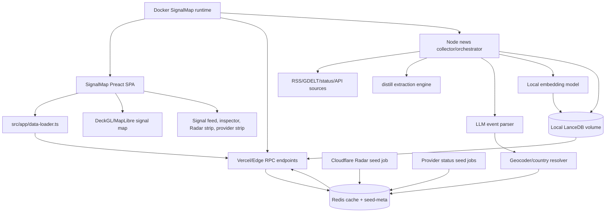

# Design Summary - SignalMap Public Intelligence Dashboard

## Problem

WorldMonitor needs to become SignalMap: a public HTTPS intelligence dashboard that removes user-facing license/API-key friction, prioritizes real Internet and provider incidents, adds an LLM-assisted geolocated story layer, and runs cleanly in a Docker container with local persistence for semantic story memory.

## Approach

Build SignalMap by reusing the existing WorldMonitor architecture instead of creating a parallel app. First remove product gating while preserving internal upstream secrets, then promote Cloudflare Radar and provider status into first-class signal layers, then add a constrained news extraction pipeline that uses the existing source catalog and optional `distill` extraction before any LLM/geocoding result can reach the map. Run the SignalMap web/API/collector stack in Docker so the collector can use local writable storage, including LanceDB for story embeddings, semantic dedupe, and related-story retrieval. Port the Claude Design prototype incrementally into the existing Preact/Vite app.

## Key Decisions

| Decision | Choice | Rationale |
|----------|--------|-----------|
| Product name | SignalMap | User selected SignalMap after name workshop. |
| UI source of truth | `docs/SignalMap/Claude_Design` | The folder contains the current high-fidelity design prototype and component vocabulary. |
| App strategy | Evolve existing Vite/Preact SPA | The repo already has map layers, data loaders, Redis-backed endpoints, seed scripts, panels, and source catalogs. A rewrite would duplicate working infrastructure. |
| Runtime target | Dockerized SignalMap web/API/collector runtime behind HTTPS | Local LanceDB and collector jobs need a persistent writable volume and a long-running Node process; Docker gives that without forcing browser or Edge runtimes to own it. |
| Public access model | Remove user-facing license/API-key gates; keep server-side upstream secrets | Public users should not paste keys. Upstream provider secrets still belong on cron/server-side jobs. |
| Internet health layer | Cloudflare Radar first | Radar outage/anomaly signals are central to the product promise. Healthy regions do not render dots. |
| Provider status layer | First-class signals, not static provider dots | Cloudflare Status, Okta, Microsoft 365, Azure, and Wasabi incidents should appear only when there is a real incident or impactful maintenance. |
| Watchlist semantics | Prioritization, not censorship | "My Regions" and "My Providers" elevate matching signals while preserving global visibility. |
| News collection | Reuse existing RSS/source catalog first; enrich selected links only | Reduces scraping/legal risk and avoids drifting source registries. |
| `distill` role | Extraction engine invoked from the Node collector/orchestrator | `distill` is TypeScript/Node. Do not port extraction into Python in v1. |
| LLM runtime | OpenRouter first, OpenAI-compatible env config, user-selectable model | User approved OpenAI-compatible endpoint via env vars, specifically OpenRouter, with model selection and pluggable provider later. |
| Vector store | Local LanceDB in the Docker data volume | Stores embeddings and metadata for accepted story events so SignalMap can dedupe, cluster, and retrieve related stories without sending every comparison back to an LLM. |
| Approved full extraction sources | Risky Business News and The Hacker News | User approved `https://risky.biz/category/risky-business-news/` and `https://thehackernews.com/` for distill descriptor extraction. Other sources remain RSS/title/snippet-only by default. |
| LLM outputs | Strict JSON with evidence and confidence gates | Prevents hallucinated locations from becoming map points. |
| Live media | Main Live News can use custom Owncast/HLS; webcams unchanged | Matches current user requirement. |

## Architecture

## Implementation Plan

### Phase 0 - Grounding and Cleanup

- Keep SignalMap docs under `docs/SignalMap`.
- Treat `docs/SignalMap/Claude_Design` as the design source.
- Inventory current gating contracts before removing them:
  - `src/services/panel-gating.ts`
  - `src/shared/premium-paths.ts`
  - `server/gateway.ts`
  - `server/_shared/premium-check.ts`
  - `api/_api-key.js`
  - `src/services/premium-fetch.ts`
  - panel constructors with `premium: 'locked'`
- Capture provider feed fixtures for Okta, Microsoft 365, Azure, and Wasabi.

### Phase 1 - Public Web Baseline

- Remove user-facing license/API-key requirements from the browser UI.
- Remove or neutralize premium overlays and premium fetch behavior for public product routes.
- Keep rate limiting, Redis caching, CORS guardrails, and server-side provider secrets.
- Keep v1 anonymous/local-only; defer sign-in/account sync to a later phase.
- Target a Dockerized SignalMap runtime behind HTTPS. Vercel can remain an optional static-hosting path only if it does not bypass container-side collectors, local LanceDB, or server-side secrets.

### Phase 2 - Radar and Provider Signal Model

- Normalize Radar outages/anomalies into a single signal event shape.
- Extend service-status adapters rather than replacing existing infrastructure code.
- Add provider-region mapping only when the feed provides reliable region/component evidence.
- Route provider incidents with weak geography to feed/inspector only; no fake map marker.
- Add stale/source-failure states for Radar and provider adapters.

### Phase 3 - Watchlists and Signal Prioritization

- Add local watchlist storage for:
  - region groups: global, North America, Europe, MENA, APAC, South Asia, Africa, South America
  - providers: Cloudflare, Okta, Microsoft 365, Azure, Wasabi
- Promote watchlist matches in:
  - command/header status
  - Radar/provider strips
  - live feed ordering
  - inspector badges
  - map marker emphasis
- Make watchlists URL-shareable after local-only behavior works.

### Phase 4 - News and LLM Story Map

- Start with existing public RSS/source configs and source tiers.
- Deduplicate stories by canonical URL, title hash, source, and time bucket.
- Use `distill` only for approved article URLs: Risky Business News and The Hacker News in v1.
- Add distill descriptor files for Risky Business News and The Hacker News under the local distill repo at `C:\Coding_Workspace\Github_P\distill`.
- Send bounded source text to an LLM with a strict JSON schema.
- Require evidence snippets, location confidence, and geocoder validation.
- Render story markers only when location confidence meets threshold.
- Upsert accepted story metadata and embeddings into local LanceDB for semantic dedupe, related-story retrieval, and future investigative search.
- Store summaries, source URLs, hashes, tags, and facts. Do not store/display full article text by default.
- Do not store full article bodies in LanceDB; store bounded summaries, evidence snippets, hashes, tags, locations, and embedding vectors.

### Phase 5 - UI Revamp From Claude Design

- Port design tokens from `tokens.css` into the existing app theme layer.
- Map prototype components to production surfaces:
  - `CommandBar` -> app command/header area
  - `RadarStrip` -> Internet health summary
  - `ProviderStrip` -> watched provider summary
  - `LeftRail` -> category/layer/watchlist controls
  - `WorldMap` concepts -> existing DeckGL/MapLibre layers
  - `Inspector` -> selected signal details panel
  - `LiveFeed` -> signal feed panel
  - `TimelineStrip` -> signal velocity strip
- Keep the real app Preact/class-component architecture; do not import the React/Babel prototype directly.

### Phase 6 - Hardening, Deployment, and Ops

- Add source health checks and seed-meta dashboards.
- Add LanceDB health checks for writable path, table availability, record count, embedding dimension, and vector-search latency.
- Add Docker runtime config for web assets, local API/collector process, Redis access, OpenRouter secrets, distill path, model cache, and LanceDB data volume.
- Add test coverage for public no-key routes, stale sources, provider parsers, confidence gates, and premium-gating removal.
- Deploy to the selected HTTPS hostname.
- Add monitoring for cron failures, upstream rate limits, LLM parse failures, embedding failures, LanceDB write/search failures, Redis miss rates, and stale data.

## Integration Points

| System | Protocol | Auth | Discovery Status |
|--------|----------|------|------------------|
| Cloudflare Radar | REST API / existing seed script | Cloudflare token server-side | PARTIAL - existing seed/RPC plumbing found; token scope and sample payloads need confirmation. |
| Cloudflare Status | Statuspage JSON endpoints | Public | VERIFIED - Cloudflare documents summary, status, components, unresolved incidents, all incidents, and maintenance endpoints at `https://www.cloudflarestatus.com/api`. |
| Okta Status RSS | RSS | Public | NEEDS DISCOVERY - fixture capture required for parser contract. |
| Microsoft 365 status feed | RSS/API feed | Public/unknown | NEEDS DISCOVERY - fixture capture required; auth requirements must be confirmed. |
| Azure status RSS | RSS | Public | NEEDS DISCOVERY - empty-success semantics must be encoded as healthy/no public issue. |
| Wasabi Status | Status page / likely Statuspage-style endpoints | Public | UNVERIFIED - page is public; API shape must be fixture-captured. |
| Existing RSS catalog | Local configs + RSS fetchers | Public | PARTIAL - current configs exist; full extraction approved only for Risky Business News and The Hacker News in v1. |
| GDELT | Public API | Public | EXISTING - keep as corroboration/event source. |
| `distill` | Node library/CLI sidecar at `C:\Coding_Workspace\Github_P\distill` | Local workspace | DECIDED - invoke as external library/CLI from collector; do not port to Python in v1. |
| OpenRouter LLM parser | OpenAI-compatible chat completions | Server env vars | DECIDED - OpenRouter first with user-selectable model. |
| Geocoder/country resolver | Existing repo resolver or fixture-backed resolver | TBD | PHASE 0 DISCOVERY - choose existing geocoding path before story-map implementation. |
| Redis/Upstash | Redis | Server env vars | EXISTING - use current cache/seed-meta pattern. |
| LanceDB local vector store | Embedded local filesystem database via Node SDK | Docker volume | DECIDED - local container persistence for story embeddings and related-story retrieval; package version must be verified during implementation. |
| Embedding model | Existing local transformer model path or collector-side embedding helper | Docker model cache | DECIDED - prefer local embeddings for LanceDB records; do not require live LLM calls for vector similarity. |
| Docker runtime | Container image + persistent volumes + HTTPS reverse proxy | Server env/secrets | DECIDED - SignalMap should run in Docker for v1; existing frontend-only Dockerfile needs extension or a SignalMap-specific runtime image. |
| Vercel Edge APIs | HTTP/RPC | Same-origin public + internal secrets | DECIDED - same-origin public browser APIs in v1; no third-party public API without keys. |
| Tauri desktop | Tauri + sidecar | Local | DECIDED - freeze for SignalMap v1; do not remove. |

## Config Surface

| Setting | Type | Source | Default |
|---------|------|--------|---------|
| `VITE_VARIANT` | string | env | `full` until SignalMap variant exists |
| Public hostname | string | deployment config | `signalmap.<domain>` placeholder until final DNS is set |
| Radar token | secret | server env | optional but primary source is stale/unavailable without it |
| Redis URL/token | secret | server env | required for production cache/seed-meta |
| Provider status polling interval | duration | env/config | 5-15 minutes |
| News polling interval | duration | env/config | 15 minutes |
| News retention | duration | env/config | 7 days |
| SignalMap data directory | path | env/config | `/data/signalmap` in Docker |
| LanceDB URI | path/URI | env/config | `/data/signalmap/lancedb` |
| Vector store enabled | boolean | env/config | `true` in Docker, `false` only for constrained fallback |
| Vector table | string | env/config | `signalmap_events` |
| Embedding model | string | env/config | `Xenova/all-MiniLM-L6-v2` unless Phase 0 selects another local model |
| Embedding cache directory | path | env/config | `/data/signalmap/models` in Docker |
| Vector retention | duration | env/config | 30 days for semantic memory; does not change 7-day public story retention |
| Region watchlist | string array | localStorage first | `['na','eu']` based on prototype |
| Provider watchlist | string array | localStorage first | `['cloudflare','azure','m365']` based on prototype |
| LLM provider/model | string | env/config | OpenRouter via OpenAI-compatible endpoint; model user-selectable |
| LLM confidence threshold | number | config | `0.7` for map markers |
| Distill mode | enum | config | invoke local distill library/CLI; no Python port in v1 |
| Allowed extraction domains | string array | shared config | `risky.biz`, `thehackernews.com` for full extraction; others RSS/snippet-only |

## Error Handling

| Scenario | Behavior |
|----------|----------|
| Radar token missing | Show Radar source as unavailable/stale; do not block the rest of the app. |
| Radar fetch failure | Keep last good data until stale threshold, mark source degraded, log seed error. |
| Provider status feed fetch failure | Mark that provider source stale/degraded; preserve other providers. |
| Empty Azure RSS fetch | Treat as no public current issue only when HTTP fetch succeeded and parser completed. |
| Provider incident has weak geography | Show in provider feed/inspector only; do not create map marker. |
| RSS source blocked/times out | Skip source for current run, log failure, update source health. |
| Distill extraction fails | Fall back to RSS title/snippet; mark extraction method as `rss`. |
| LLM returns invalid JSON | Reject event, log parse failure, no map marker. |
| LLM gives low-confidence location | Store/feed item without marker, with low-confidence explanation. |
| Geocoder ambiguity | Require country/region evidence; otherwise do not render point. |
| LanceDB path missing or unwritable | Disable vector upserts/search, mark vector memory degraded, continue Redis-backed live signals. |
| LanceDB schema/index mismatch | Fail vector-store tests; runtime opens read-only/fallback if possible and exposes degraded health until migration/rebuild succeeds. |
| Embedding model unavailable | Skip vector write for that item, keep canonical URL/title-hash dedupe, and record embedding failure. |
| Vector search timeout | Fall back to non-semantic dedupe and related-story empty state; do not block map/API response. |
| Redis unavailable | Return degraded empty responses with source-health error; avoid crashing SPA. |
| Public endpoint abuse | Same-origin CORS, rate limiting, cache tiers, and bounded response payloads. |

## Observability

- Metrics:
  - seed duration and success/failure by source
  - source freshness/staleness by key
  - provider incidents normalized by provider
  - Radar outages/anomalies normalized
  - LLM parse success/failure rate
  - geocoding acceptance/rejection rate
  - embedding generation success/failure rate
  - LanceDB record count, upsert count, query latency, and health state
  - map marker count by category/severity
  - cache hit/miss rate for SignalMap endpoints
- Logging:
  - structured server logs with source id, adapter, run id, item count, duration, and error class
  - no full article bodies in logs
- Health checks:
  - reuse seed-meta pattern
  - public health endpoint reports source freshness without exposing secrets
  - mark Radar/provider/news as independent health domains

## Testing Strategy

- Archetype: data pipeline + API service + frontend integration.
- Mock boundaries:
  - external status/RSS/Radar feeds use fixtures
  - LLM parser uses schema fixtures and deterministic mock outputs
  - geocoder uses fixture resolver
  - Redis uses existing test/memory mock pattern where available
  - LanceDB uses a temp local directory with deterministic mock vectors
- Critical path:
  - public web routes work without user API/license keys
  - premium gate removal does not break same-origin rate limiting
  - Radar/provider sources never render healthy placeholder dots
  - weak-geography provider incidents remain feed-only
  - low-confidence LLM locations do not create map markers
  - LanceDB failures degrade semantic dedupe/related-story retrieval without hiding live signals
  - Docker runtime can start with a mounted data volume and report LanceDB health
  - source health/stale states are visible in UI
  - Claude Design-derived layout remains responsive at desktop and mobile widths

## Contract Tracing

### Contracts Requiring Trace Before Implementation

| Contract | Callers / Surfaces To Trace | Risk |
|----------|-----------------------------|------|
| Premium gate removal | `Panel`, `panel-layout`, `panel-gating`, `premiumFetch`, `runtime`, `server/gateway`, `PREMIUM_RPC_PATHS`, tests matching premium behavior | Removing gates can create 401s, stale UI locks, or broken tests if done piecemeal. |
| Public API access | `api/_api-key.js`, `api/bootstrap.js`, `api/rss-proxy.js`, `api/seed-health.js`, gateway route wrappers | User-facing keys should go away; internal cron/admin routes still need protection. |
| Provider status normalization | `list-service-statuses`, seed scripts, frontend status panels, future SignalMap strips | Must define active/resolved/maintenance handling consistently. |
| Radar signal normalization | `seed-internet-outages`, `list-internet-outages`, `list-traffic-anomalies`, map layers | Must avoid duplicate semantics across outage/anomaly/DDoS records. |
| LLM story event schema | collector, LLM parser, geocoder, Redis store, RPC, data-loader, map layer, inspector | Strict schema must be identical across boundaries. |
| Watchlist state | localStorage, URL params, command bar, strips, feed ordering, map emphasis | Watchlists prioritize; they must not hide critical global signals unless explicitly filtered. |

### Status Tables Required Before Spec

Provider status adapter:

| Input status | Geography confidence | Signal output |
|--------------|----------------------|---------------|
| operational | any | no incident signal, source health only |
| degraded/partial/major | reliable region/component | provider incident + optional map marker |
| degraded/partial/major | weak/unknown geography | provider incident feed only |
| maintenance with impact | reliable region/component | maintenance incident + optional marker |
| maintenance no impact | any | source/feed context only, no marker |
| resolved recent | reliable | feed/inspector recent state; no active marker unless recency mode requests it |

LLM story event:

| Parser result | Geocoder result | Signal output |
|---------------|-----------------|---------------|
| valid JSON, confidence >= threshold | exact/region coords | story signal + marker |
| valid JSON, confidence >= threshold | country only | story signal + country shading, no invented city point |
| valid JSON, confidence < threshold | any | feed-only, no marker |
| invalid JSON | any | reject, log parse failure |
| no location evidence | none | feed-only or discard from map layer |

## Scope

In scope:

- Public web conversion for the SPA/API experience.
- Removal of user-facing product/license/API-key gates.
- Cloudflare Radar as primary Internet-health signal layer.
- Provider status normalization for Cloudflare Status, Okta, Microsoft 365, Azure, and Wasabi.
- Region/provider watchlists.
- Reuse of existing public source catalog and source-tier metadata.
- Optional `distill` enrichment for approved URLs.
- LLM-assisted categorization/geolocation with confidence gates.
- Local LanceDB vector memory for accepted story metadata, embeddings, semantic dedupe, and related-story retrieval.
- Dockerized runtime with persistent data/model volumes for SignalMap web/API/collector services.
- UI revamp based on `docs/SignalMap/Claude_Design`.
- Main Live News custom Owncast/HLS stream support.

Out of scope:

- Deleting legal license/copyright notices.
- Building a marketing landing page before the dashboard.
- Rendering dots for static context layers with no active incident.
- Full article republication or long article storage/display.
- Scraping paywalled/disallowed content.
- Rewriting the app from scratch in React.
- Making VLC/ffmpeg part of browser playback.
- LanceDB Enterprise or remote vector database hosting in v1.
- Using LanceDB as the source of truth for active Radar/provider incidents; Redis/seed-meta remain the live signal cache.

Phase 2 candidates:

- Account-synced watchlists and alerts.
- Public read-only MCP surface.
- Mobile-native/PWA packaging.
- Additional providers beyond the initial five.
- Per-user alert delivery by email/web push.
- Advanced incident correlation/scoring across Radar, provider status, and news.

## Resolved Scoping Decisions

- Public hostname: use `signalmap.<domain>` as the spec placeholder; final DNS value is deployment-time configuration.
- Sign-in/account scope: v1 is anonymous/local-only; account-synced preferences and alerts are later work.
- Tauri desktop scope: freeze for SignalMap v1 and avoid removal work.
- LLM runtime: use OpenRouter through OpenAI-compatible env vars, with a user-selectable model.
- Runtime/deployment: run SignalMap in Docker with a persistent data volume; HTTPS is handled by deployment reverse proxy/DNS configuration.
- Vector memory: use local LanceDB in the Docker data volume for story embeddings and semantic retrieval.
- `distill` mode: invoke the local Node distill library/CLI from the collector; do not port extraction into Python in v1.
- Freshness/retention: Radar/provider polling every 5-15 minutes, news polling every 15 minutes, 7-day retention.
- API exposure: same-origin public browser APIs in v1; no unauthenticated third-party public API surface.
- Full extraction allowlist: Risky Business News and The Hacker News in v1; all other news sources remain RSS/title/snippet-only unless later approved.

## Current Risks / Ambiguities

- Removing premium gates is cross-cutting. It affects frontend panel construction, runtime fetch behavior, server gateway checks, tests, docs, and user-facing copy.
- Cloudflare Radar is central, but token scope, rate limits, and sample payload details still need discovery.
- Provider status feeds differ. Statuspage JSON, RSS-only feeds, and empty-success feeds need separate adapter contracts.
- `distill` is a Node/TypeScript descriptor-driven extraction tool in `C:\Coding_Workspace\Github_P\distill`. The SignalMap collector should call it through a Node library/CLI bridge with explicit timeout and fallback behavior.
- The current Dockerfile is frontend-only. SignalMap needs either an extended runtime image or a separate SignalMap Dockerfile that runs the local API/collector process and mounts LanceDB/model-cache volumes.
- LanceDB adds local state. Backups, retention, schema migration, and degraded-mode behavior must be explicit so vector memory never becomes a hidden hard dependency for live map rendering.
- LLM location extraction can create false certainty. The map layer must reject weak location evidence.
- Direct scraping has legal and operational risk. RSS/API-first is the safer default.
- The Claude Design prototype uses React/Babel and Material Symbols. The production app is Preact/Vite with existing class-based panels, so direct import is not the plan.

## Proposed Simplification

- Do not build a new SignalMap app. Create a SignalMap variant/layout inside the existing app first.
- Do not port `distill` to Python in v1. Invoke it from the collector if needed.
- Do not add account sync until local watchlists work.
- Do not display article bodies. Display short summaries, source links, evidence snippets, and confidence.
- Do not normalize every existing panel into SignalMap v1. Start with Radar, provider status, story map, source health, and inspector.

## Open Items

| Item | Status | Blocking |
|------|--------|----------|
| Exact public hostname | DEFERRED TO DEPLOYMENT - use `signalmap.<domain>` placeholder in spec | no |
| Sign-in/account scope | DECIDED - v1 anonymous/local-only; account sync later | no |
| Tauri desktop scope | DECIDED - freeze for v1; do not remove | no |
| LLM provider/runtime | DECIDED - OpenRouter OpenAI-compatible endpoint with user-selectable model | no |
| `distill` invocation mode | DECIDED - invoke local distill library/CLI; do not port to Python | no |
| Freshness and retention target | DECIDED - provider/Radar 5-15m, news 15m, retention 7d | no |
| API exposure policy | DECIDED - same-origin public browser APIs in v1 | no |
| Docker runtime | DECIDED - Dockerized SignalMap web/API/collector runtime with persistent data volume | no |
| Local LanceDB | DECIDED - use local LanceDB for story embeddings and semantic retrieval | no |
| Approved full-extraction sources | DECIDED - Risky Business News and The Hacker News only in v1 | no |
| Cloudflare Radar token scope and fixtures | PHASE 0 DISCOVERY | no |
| Okta/Microsoft/Azure/Wasabi fixtures | PHASE 0 DISCOVERY | no |
| Geocoder path | PHASE 0 DISCOVERY | no |
| LanceDB package version and Docker runtime compatibility | PHASE 0 DISCOVERY | no |

## Foreman Status

This design summary is ready for Foreman spec generation. Remaining discovery items are Phase 0 implementation units, not blockers to writing the spec.
