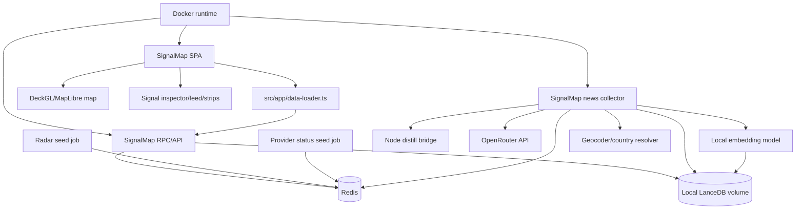

# SignalMap Implementation Spec

## Intent

Build SignalMap as the public-web evolution of WorldMonitor. The implementation removes user-facing license/API-key friction, makes Cloudflare Radar and provider status first-class signal layers, adds local region/provider watchlists, introduces a constrained LLM story-map pipeline using OpenRouter and `distill` for approved sources only, and runs the SignalMap runtime in Docker with local LanceDB vector memory for accepted stories.

Primary design input: [design-summary.md](./design-summary.md).

## Decisions And Notes

| Decision | Choice | Source |
|----------|--------|--------|
| App strategy | Evolve existing Vite/Preact SPA; do not rewrite in React | Design summary |
| UI source | Port concepts from `docs/SignalMap/Claude_Design` | User + design summary |
| Public access | Remove user-facing license/API-key gates; preserve internal secrets and rate limits | User + design summary |
| Runtime target | Dockerized SignalMap web/API/collector runtime behind HTTPS | User decision |
| Hostname | Use `signalmap.<domain>` placeholder until DNS is final | User accepted defaults |
| Sign-in | v1 anonymous/local-only; account sync later | User accepted defaults |
| Desktop | Freeze Tauri for v1; do not remove | User accepted defaults |
| API policy | Same-origin public browser APIs; no third-party public API surface in v1 | User accepted defaults |
| LLM runtime | OpenRouter through OpenAI-compatible env vars; user-selectable model from server allowlist | User decision |
| LLM confidence threshold | `0.7` minimum location confidence for map markers | Design summary |
| Vector memory | Local LanceDB in Docker data volume for story embeddings, semantic dedupe, and related-story retrieval | User decision |
| Embeddings | Prefer local collector-side embeddings; do not require LLM calls for vector similarity | Design summary |
| Distill root | `C:\Coding_Workspace\Github_P\distill` for local development | User decision |
| Distill mode | Invoke local Node library/bridge; do not port to Python in v1 | User decision |
| Full extraction allowlist | Risky Business News and The Hacker News only | User decision |
| News polling/retention | Poll every 15 minutes; retain 7 days | User accepted defaults |
| Radar/provider polling | 5-15 minutes | User accepted defaults |

## Existing Project Facts

Verified from live files:

- Package manager/runtime: Node/Vite project with `package.json`.
- Main app framework: `preact` `^10.25.4`.
- Build tool: `vite` `^6.0.7`.
- TypeScript: `typescript` `^5.7.2`.
- Map stack: `deck.gl` `^9.2.11`, `maplibre-gl` `^5.16.0`.
- Existing browser-side vector memory: `src/workers/vector-db.ts` stores embeddings in IndexedDB for headline memory; SignalMap LanceDB is a server/container-side store and must not replace browser IndexedDB code.
- Existing Dockerfile: `docker/Dockerfile` builds frontend assets and serves them with nginx only; SignalMap needs an extended or separate runtime image for the local API/collector/LanceDB path.
- Test commands:
  - `npm run typecheck`
  - `npm run typecheck:api`
  - `npm run test:data`
  - `npm run test:sidecar`
  - `npm run test:e2e`
- Distill project at `C:\Coding_Workspace\Github_P\distill`:
  - package name `distill`
  - version `1.0.0`
  - TypeScript `^5.7.0`
  - Cheerio `^1.2.0`
  - generic extraction API: `new Distill({ descriptors }).extract(url)`
  - bundled descriptor schema in `Docs/dom-descriptor-spec.md`

## Architecture



Redis remains the live signal cache and source-health surface. LanceDB is a local semantic memory for story events and related-story lookup; it is not the source of truth for active Radar/provider incidents.

## Target File Structure

```text
docs/SignalMap/
  spec.md
  handoff.md
  PROGRESS.md
  testing-harness.md

src/types/signalmap.ts
src/config/signalmap.ts
src/services/signalmap-watchlist.ts
src/services/signalmap.ts
src/components/SignalMapShell.ts
src/components/SignalMapInspector.ts
src/components/SignalMapFeed.ts
src/components/SignalMapStatusStrips.ts

proto/worldmonitor/signalmap/v1/service.proto
server/worldmonitor/signalmap/v1/handler.ts
server/worldmonitor/signalmap/v1/list-signals.ts
server/worldmonitor/signalmap/v1/_normalizers.ts
server/worldmonitor/signalmap/v1/_provider-status.ts
server/worldmonitor/signalmap/v1/_radar.ts

scripts/signalmap-news-collector.mjs
scripts/signalmap-distill-bridge.mjs
scripts/signalmap-openrouter-parser.mjs
scripts/signalmap-geocoder.mjs
scripts/signalmap-embedding-model.mjs
scripts/signalmap-lancedb-store.mjs

tests/signalmap-public-access.test.mjs
tests/signalmap-provider-status.test.mjs
tests/signalmap-radar-normalization.test.mjs
tests/signalmap-news-collector.test.mjs
tests/signalmap-llm-schema.test.mjs
tests/signalmap-lancedb-store.test.mjs
tests/signalmap-watchlist.test.mjs
tests/signalmap-docker-runtime.test.mjs

docker/Dockerfile.signalmap
docker/supervisord.signalmap.conf
docker/signalmap-entrypoint.sh
docker-compose.signalmap.yml

C:\Coding_Workspace\Github_P\distill\descriptors\risky-business-news.json
C:\Coding_Workspace\Github_P\distill\descriptors\the-hacker-news.json
C:\Coding_Workspace\Github_P\distill\test\fixtures\risky-business-news-article.html
C:\Coding_Workspace\Github_P\distill\test\fixtures\the-hacker-news-article.html
C:\Coding_Workspace\Github_P\distill\src\__tests__\news-descriptors.test.ts
```

Do not edit `src/generated/` manually. If a proto service is added, regenerate stubs using the repo's proto workflow.

## Integration Discovery Findings

| Item | Finding | Status |
|------|---------|--------|
| Existing Docker runtime | `docker/Dockerfile` is a frontend/nginx image. `docker/supervisord.conf` and `docker/entrypoint.sh` show local nginx + Node process patterns that can be reused for SignalMap. | VERIFIED from repo files |
| Existing vector memory | `src/workers/vector-db.ts` stores browser-side headline embeddings in IndexedDB. SignalMap LanceDB must be server/container-side and must not replace that browser feature. | VERIFIED from repo files |
| LanceDB JS local mode | Official LanceDB JS docs show local filesystem URIs and the `@lancedb/lancedb` package for Node/TypeScript use. | VERIFIED from official docs: https://lancedb.github.io/lancedb/js/ |
| LanceDB package version | Current installable version is not in this repo. | UNKNOWN - verify with `npm view @lancedb/lancedb version` before implementation |
| Docker HTTPS termination | The repo has nginx config, but final domain/reverse proxy/TLS termination is deployment-specific. | DEFERRED to deployment config |

## Config Schema

Use environment variables for server/collector behavior:

| Name | Required | Default | Notes |
|------|----------|---------|-------|
| `SIGNALMAP_PUBLIC_HOSTNAME` | no | `signalmap.<domain>` | Deployment display/config only until DNS is final. |
| `SIGNALMAP_RSS_POLL_MINUTES` | no | `15` | News collector cadence. |
| `SIGNALMAP_RETENTION_DAYS` | no | `7` | Story/event retention. |
| `SIGNALMAP_PROVIDER_POLL_MINUTES` | no | `10` | Provider status collector cadence. |
| `SIGNALMAP_RADAR_POLL_MINUTES` | no | `10` | Radar collector cadence. |
| `SIGNALMAP_DISTILL_ROOT` | local dev yes | `C:\Coding_Workspace\Github_P\distill` | Collector-side only. Not browser or Edge runtime. |
| `SIGNALMAP_DISTILL_TIMEOUT_MS` | no | `15000` | Per article extraction timeout. |
| `OPENROUTER_API_KEY` | for LLM yes | none | Server/collector secret. Never expose to browser. |
| `OPENROUTER_BASE_URL` | no | `https://openrouter.ai/api/v1` | OpenAI-compatible endpoint. |
| `SIGNALMAP_LLM_MODELS` | no | operator-defined | Comma-separated allowlist visible to UI. |
| `SIGNALMAP_LLM_DEFAULT_MODEL` | no | first allowlisted model | Must be a member of `SIGNALMAP_LLM_MODELS`. |
| `SIGNALMAP_LLM_TIMEOUT_MS` | no | `30000` | LLM request timeout. |
| `SIGNALMAP_LLM_MAX_INPUT_CHARS` | no | `12000` | Hard cap before prompt construction. |
| `SIGNALMAP_LOCATION_CONFIDENCE_MIN` | no | `0.7` | Minimum to render story marker. |
| `SIGNALMAP_FULL_EXTRACTION_DOMAINS` | no | `risky.biz,thehackernews.com` | Full extraction allowlist. |
| `SIGNALMAP_DATA_DIR` | no | `/data/signalmap` in Docker | Parent directory for local persistent state. |
| `SIGNALMAP_LANCEDB_URI` | no | `/data/signalmap/lancedb` | Local LanceDB URI/path. Must be on a persistent Docker volume in production. |
| `SIGNALMAP_VECTOR_ENABLED` | no | `true` | When `false`, collector skips LanceDB and semantic related-story features. |
| `SIGNALMAP_VECTOR_TABLE` | no | `signalmap_events` | LanceDB table for story vectors. |
| `SIGNALMAP_VECTOR_RETENTION_DAYS` | no | `30` | Semantic memory retention. Does not change public 7-day story/event retention. |
| `SIGNALMAP_VECTOR_SEARCH_TIMEOUT_MS` | no | `3000` | Max time for related-story/vector lookup before fallback. |
| `SIGNALMAP_VECTOR_TOP_K` | no | `8` | Max related stories returned per selected story. |
| `SIGNALMAP_VECTOR_MIN_SCORE` | no | `0.72` | Minimum similarity for related-story results. |
| `SIGNALMAP_EMBEDDING_MODEL` | no | `Xenova/all-MiniLM-L6-v2` | Collector-side local embedding model. |
| `SIGNALMAP_EMBEDDING_DIM` | no | `384` | Must match the configured embedding model; Phase 3 tests verify this. |
| `TRANSFORMERS_CACHE` | no | `/data/signalmap/models` | Docker-mounted model cache for local embeddings. |

Client/local config:

| Key | Storage | Default |
|-----|---------|---------|
| `signalmap-watch-regions` | localStorage | `["na","eu"]` |
| `signalmap-watch-providers` | localStorage | `["cloudflare","azure","m365"]` |
| `signalmap-active-categories` | localStorage | all SignalMap categories |
| `signalmap-llm-model` | localStorage | server default model |

## Core Data Contracts

Define these in `src/types/signalmap.ts` and mirror them in proto/server response types.

```ts
export type SignalMapCategory =
  | 'internet'
  | 'provider'
  | 'technology'
  | 'finance'
  | 'geopolitics'
  | 'conflict'
  | 'cyber'
  | 'climate'
  | 'health'
  | 'energy'
  | 'supply_chain'
  | 'infrastructure';

export type SignalMapSeverity = 'critical' | 'high' | 'medium' | 'low' | 'info';

export interface SignalMapLocation {
  name: string;
  countryIso2?: string;
  lat?: number;
  lon?: number;
  scope: 'city' | 'region' | 'country' | 'network' | 'provider' | 'unknown';
  confidence: number;
  evidence?: string;
}

export interface SignalMapSource {
  id: string;
  label: string;
  url?: string;
  tier?: number;
  verified?: boolean;
  fetchedAt?: string;
}

export interface SignalMapEvent {
  id: string;
  category: SignalMapCategory;
  severity: SignalMapSeverity;
  title: string;
  summary: string;
  tags: string[];
  startedAt?: string;
  endedAt?: string;
  lastObservedAt: string;
  locations: SignalMapLocation[];
  sources: SignalMapSource[];
  confidence: number;
  provider?: 'cloudflare' | 'okta' | 'm365' | 'azure' | 'wasabi' | string;
  kind: 'radar_outage' | 'radar_anomaly' | 'provider_status' | 'story';
  watchlistMatch: boolean;
  markerEligible: boolean;
}
```

## Distill Descriptor Output Contract

The Risky Business News and The Hacker News descriptors must output this shape:

```ts
export interface DistilledNewsArticle {
  title: string;
  dek?: string;
  author?: string;
  publishedAt?: string;
  updatedAt?: string;
  articleBody: string;
  tags?: string[];
  canonicalUrl: string;
  sourceName: 'Risky Business News' | 'The Hacker News';
}
```

Descriptor requirements:

- `title`, `articleBody`, `canonicalUrl`, and `sourceName` are required.
- `articleBody` must exclude nav, ads, newsletter boxes, sidebars, related-post blocks, comments, scripts, and styles.
- Descriptors must be validated against local HTML fixtures before live use.
- The implementation must not hardcode selectors from memory. Generate or refine selectors from captured fixtures.

## LanceDB Vector Record Contract

Define the collector-side record shape in `scripts/signalmap-lancedb-store.mjs` and keep the public API response as a metadata-only projection. Store vectors and bounded metadata only; never store full article bodies.

```ts
export interface SignalMapVectorRecord {
  id: string;
  eventId: string;
  canonicalUrl: string;
  sourceName: string;
  title: string;
  summary: string;
  category: SignalMapCategory;
  tags: string[];
  severity: SignalMapSeverity;
  publishedAt?: string;
  lastObservedAt: string;
  locationsJson: string;
  locationNames: string[];
  countryIso2: string[];
  confidence: number;
  contentHash: string;
  sourceTextHash: string;
  embeddingModel: string;
  embeddingDim: number;
  vector: number[];
}
```

LanceDB requirements:

- Connect with `@lancedb/lancedb` using `SIGNALMAP_LANCEDB_URI`.
- Create/open `SIGNALMAP_VECTOR_TABLE` idempotently.
- Validate `vector.length === SIGNALMAP_EMBEDDING_DIM` before upsert.
- Use deterministic mock vectors in tests; do not download models in normal unit tests.
- Use LanceDB for semantic dedupe, related-story lookup, and future investigative search only.
- Redis/seed-meta remains the live signal API cache.

## LLM Parser Contract

OpenRouter requests use the OpenAI-compatible chat completions endpoint. The implementation must:

- Read API key only from `OPENROUTER_API_KEY`.
- Use only a model from `SIGNALMAP_LLM_MODELS`.
- Send bounded article text, not raw HTML.
- Fence extracted content as untrusted data.
- Require strict JSON output with no markdown wrapper.
- Reject invalid JSON.
- Reject any location without evidence text.

Expected LLM response:

```json
{
  "canonicalTitle": "string",
  "summary": "string",
  "category": "technology",
  "tags": ["string"],
  "severity": "medium",
  "eventTime": "2026-04-25T00:00:00Z",
  "locations": [
    {
      "name": "string",
      "countryIso2": "US",
      "confidence": 0.8,
      "evidence": "exact phrase from source"
    }
  ],
  "confidence": 0.8
}
```

## Core Behavior

1. Public user opens SignalMap without a license key or API key.
2. App loads same-origin SignalMap endpoints through existing data-loader patterns.
3. Radar/provider/status/news sources publish normalized events into Redis and `seed-meta`.
4. Map renders only marker-eligible events.
5. Provider/Radar healthy states update source health but do not create markers.
6. Watchlist matches are promoted in strips, feed, inspector, and marker styling.
7. The news collector discovers RSS items and only full-extracts Risky Biz and The Hacker News article URLs.
8. Distilled text goes to OpenRouter with strict schema constraints.
9. LLM/geocoder output below confidence threshold stays feed-only.
10. Accepted story events are embedded locally and upserted into LanceDB for semantic dedupe and related-story retrieval.
11. LanceDB failures degrade vector features but do not block Redis-backed map events.
12. UI ports Claude Design concepts incrementally into existing Preact components.

## Error Handling

| Scenario | Behavior | Recovery |
|----------|----------|----------|
| Missing `OPENROUTER_API_KEY` | Skip LLM story parsing; source health shows LLM unavailable | Continue RSS/Radar/provider sources |
| OpenRouter timeout/error | Mark LLM run failed for source item; no marker | Retry next poll; do not retry tight loop |
| Model not in allowlist | Reject selection and fall back to default | Log config warning |
| Distill root missing | Full extraction disabled; use RSS/snippet-only | Source health degraded |
| Distill descriptor missing | Skip that domain's full extraction | Fail descriptor test in Phase 0 |
| Distill extraction timeout | Use RSS/snippet fallback | Record extraction failure metric |
| LLM invalid JSON | Reject parsed event | Store parse error counter only |
| Low location confidence | Feed-only item, no marker | Show low-confidence explanation in inspector |
| Provider status fetch fails | Mark provider stale/degraded | Preserve last good data until stale threshold |
| Provider status operational | No incident signal | Source health only |
| Azure RSS empty success | Treat as no current public issue | Source health ok |
| Radar token missing | Radar unavailable/stale | App continues |
| LanceDB URI missing or unwritable | Disable vector upserts/search and mark vector memory degraded | Continue Redis-backed signal pipeline |
| LanceDB table schema mismatch | Fail tests; runtime enters degraded vector mode if possible | Rebuild or migrate table after reviewing schema |
| Embedding model download/load failure | Skip vector write for item | Keep canonical URL/title-hash dedupe and record failure |
| Vector dimension mismatch | Reject vector write and fail `tests/signalmap-lancedb-store.test.mjs` | Align `SIGNALMAP_EMBEDDING_DIM` with model output |
| LanceDB search timeout | Return empty related-story results | Keep selected signal inspector usable |
| Redis unavailable | Return degraded empty responses | Browser shows partial source failure |
| Public endpoint abuse | Same-origin CORS, rate limits, cache tiers | Return 429 or cached/stale response |

## Metrics And Outputs

| Metric | Type | Source |
|--------|------|--------|
| `signalmap_source_freshness_seconds` | gauge | seed-meta timestamps |
| `signalmap_provider_incidents_total` | counter | provider normalizer |
| `signalmap_radar_events_total` | counter | radar normalizer |
| `signalmap_distill_success_total` | counter | distill bridge |
| `signalmap_distill_failure_total` | counter | distill bridge |
| `signalmap_llm_parse_success_total` | counter | OpenRouter parser |
| `signalmap_llm_parse_failure_total` | counter | OpenRouter parser |
| `signalmap_geocode_reject_total` | counter | geocoder |
| `signalmap_embedding_failure_total` | counter | embedding model |
| `signalmap_lancedb_up` | gauge | LanceDB health check |
| `signalmap_lancedb_records_total` | gauge | LanceDB table count |
| `signalmap_lancedb_upserts_total` | counter | LanceDB store |
| `signalmap_lancedb_search_latency_ms` | histogram | related-story search |
| `signalmap_marker_eligible_total` | gauge | SignalMap API |

## Dependencies

| Package | Version | Purpose |
|---------|---------|---------|
| `preact` | `^10.25.4` | SPA UI |
| `vite` | `^6.0.7` | frontend build |
| `typescript` | `^5.7.2` | app typechecking |
| `deck.gl` | `^9.2.11` | map layers |
| `maplibre-gl` | `^5.16.0` | map renderer |
| `fast-xml-parser` | `^5.3.7` | RSS/XML parsing |
| `@upstash/redis` | `^1.36.1` | Redis cache |
| `@xenova/transformers` | `^2.17.2` | Existing local embedding model dependency |
| `@lancedb/lancedb` | UNKNOWN | Local LanceDB vector store; verify with `npm view @lancedb/lancedb version` before adding |
| `distill` | local `1.0.0` | approved article extraction |
| `cheerio` in distill | `^1.2.0` | descriptor DOM extraction |

No browser dependency should import `distill` or `@lancedb/lancedb`. Use them only in Node collector/local API code running in the Docker runtime.

## Out Of Scope

- Deleting legal license/copyright notices.
- Third-party public API platform in v1.
- Account-synced watchlists and alerts.
- Rendering healthy provider regions as dots.
- Scraping paywalled/disallowed content.
- Rewriting the app in React.
- VLC/ffmpeg for browser playback.
- Full article storage/display.
- LanceDB Enterprise or any remote vector database in v1.
- Making LanceDB a hard dependency for Radar/provider incident rendering.

## Testing Strategy

Archetype: data pipeline + API service + frontend integration.

| Area | Test Type | Files |
|------|-----------|-------|
| Public access | source/static tests + handler tests | `tests/signalmap-public-access.test.mjs` |
| Provider status | fixture parser tests | `tests/signalmap-provider-status.test.mjs` |
| Radar | fixture normalizer tests | `tests/signalmap-radar-normalization.test.mjs` |
| Distill descriptors | distill fixture tests | `C:\Coding_Workspace\Github_P\distill\src\__tests__\news-descriptors.test.ts` |
| News collector | mocked integration | `tests/signalmap-news-collector.test.mjs` |
| LLM schema | pure unit + mocked OpenRouter | `tests/signalmap-llm-schema.test.mjs` |
| LanceDB vector store | temp-dir mocked integration | `tests/signalmap-lancedb-store.test.mjs` |
| Watchlist | pure unit | `tests/signalmap-watchlist.test.mjs` |
| UI | Playwright smoke/visual after shell exists | `e2e/signalmap.spec.ts` |
| Docker runtime | static config + optional smoke | `tests/signalmap-docker-runtime.test.mjs` |

Do not hit live OpenRouter, live news sites, or live model downloads in normal test runs.

## Implementation Order

### Phase 0: Discovery And Contract Grounding

**Unit 0a: Provider/Radar fixture capture**

Files:

- `tests/fixtures/signalmap/cloudflare-status-summary.json`
- `tests/fixtures/signalmap/okta-status.xml`
- `tests/fixtures/signalmap/m365-status.xml`
- `tests/fixtures/signalmap/azure-status.xml`
- `tests/fixtures/signalmap/wasabi-status.xml`
- `tests/fixtures/signalmap/cloudflare-radar-outage.json`
- `tests/fixtures/signalmap/cloudflare-radar-anomaly.json`

Directives:

- Capture representative successful payloads.
- Include at least one empty-success Azure feed fixture.
- Do not put API tokens in fixtures.
- If a live fixture cannot be fetched, create a minimal fixture from documented structure and mark it `UNVERIFIED` in a comment in the test file.

Test command: `npm run test:data`

**Unit 0b: Distill descriptor discovery**

Files in `C:\Coding_Workspace\Github_P\distill`:

- `descriptors/risky-business-news.json`
- `descriptors/the-hacker-news.json`
- `test/fixtures/risky-business-news-article.html`
- `test/fixtures/the-hacker-news-article.html`
- `src/__tests__/news-descriptors.test.ts`

Directives:

- Use `npm run create-descriptor -- <sample-url> --name <name> --out <descriptor>` as the starting point.
- Refine descriptors only against captured fixtures.
- Required extracted fields: `title`, `articleBody`, `canonicalUrl`, `sourceName`.
- Add tests that import `extract` from `src/extractor.ts` and assert the output contract.

Test command: from `C:\Coding_Workspace\Github_P\distill`, run `npm test`.

**Unit 0c: Premium/gating impact inventory**

Files:

- `tests/signalmap-public-access.test.mjs`

Directives:

- Grep and assert current references for `premiumFetch`, `PREMIUM_RPC_PATHS`, `validateApiKey`, `premium: 'locked'`, and license copy before changes.
- This test starts as an inventory/guardrail and is updated in Phase 1 to assert the new public behavior.

Test command: `npm run test:data`

**Unit 0d: Docker and LanceDB runtime inventory**

Files:

- `tests/signalmap-docker-runtime.test.mjs`

Directives:

- Assert the current `docker/Dockerfile` is frontend/nginx-only so the later SignalMap runtime work is explicit.
- Inventory `docker/supervisord.conf`, `docker/entrypoint.sh`, and `docker/docker-entrypoint.sh` for reusable local API/nginx process patterns.
- Add expected env keys for `SIGNALMAP_DATA_DIR`, `SIGNALMAP_LANCEDB_URI`, `TRANSFORMERS_CACHE`, `OPENROUTER_API_KEY`, and Redis configuration.
- Do not build a Docker image in this unit.

Test command: `npm run test:data`

CHECKPOINT: `npm run test:data`

### Phase 1: Public Web Baseline

**Unit 1a: Public API gate policy**

Files:

- `api/bootstrap.js`
- `api/rss-proxy.js`
- `server/gateway.ts`
- `tests/signalmap-public-access.test.mjs`

Directives:

- Remove user-facing key requirements for public browser bootstrap/RSS paths.
- Preserve force-key behavior for cron/admin/webhook routes.
- Preserve CORS and rate limits.

Test command: `npm run test:data`

**Unit 1b: Frontend premium UI removal**

Files:

- `src/components/Panel.ts`
- `src/services/panel-gating.ts`
- `src/config/panels.ts`
- `src/locales/en.json`
- `tests/signalmap-public-access.test.mjs`

Directives:

- Public SignalMap must not show "requires license key" overlays.
- Do not delete legal license notices.
- Panels should degrade because a source is unavailable, not because a user lacks a product key.

Test command: `npm run typecheck`

**Unit 1c: Premium fetch/client cleanup**

Files:

- `src/services/premium-fetch.ts`
- service modules currently importing `premiumFetch`
- `src/shared/premium-paths.ts`
- affected tests found by grep

Directives:

- Convert SignalMap-public calls to normal generated clients or `globalThis.fetch`.
- Keep any internal/admin-only premium path behavior explicitly documented if it remains.
- Update tests that asserted old premium behavior.

Test command: `npm run typecheck:all && npm run test:data`

CHECKPOINT: `npm run typecheck:all && npm run test:data`

### Phase 2: SignalMap Contracts And RPC

**Unit 2a: Types and config**

Files:

- `src/types/signalmap.ts`
- `src/config/signalmap.ts`
- `tests/signalmap-watchlist.test.mjs`

Directives:

- Define categories, providers, region groups, severities, event contracts, and confidence thresholds.
- Keep top-level category values controlled; no free-form categories.

Test command: `npm run typecheck`

**Unit 2b: Proto/RPC shell**

Files:

- `proto/worldmonitor/signalmap/v1/service.proto`
- `server/worldmonitor/signalmap/v1/handler.ts`
- `server/worldmonitor/signalmap/v1/list-signals.ts`
- generated files via `make generate`

Directives:

- Add `ListSignalMapEvents` response with events and source health.
- Do not edit generated files manually.
- Cache response by time range/category/watchlist filters.

Test command: `npm run typecheck:api`

**Unit 2c: Radar normalizer**

Files:

- `server/worldmonitor/signalmap/v1/_radar.ts`
- `tests/signalmap-radar-normalization.test.mjs`

Directives:

- Normalize existing outage/anomaly cached payloads into `SignalMapEvent`.
- Healthy/no-data states create source health only, not markers.

Test command: `npm run test:data`

**Unit 2d: Provider status normalizer**

Files:

- `server/worldmonitor/signalmap/v1/_provider-status.ts`
- `tests/signalmap-provider-status.test.mjs`

Directives:

- Support Cloudflare Status, Okta, Microsoft 365, Azure, and Wasabi fixtures.
- Operational status creates no event.
- Weak geography creates feed-only events with `markerEligible: false`.

Test command: `npm run test:data`

CHECKPOINT: `npm run typecheck:all && npm run test:data`

### Phase 3: News Collector, Distill, OpenRouter, Geocoder, LanceDB

**Unit 3a: Distill bridge**

Files:

- `scripts/signalmap-distill-bridge.mjs`
- `tests/signalmap-news-collector.test.mjs`

Directives:

- Load distill from `SIGNALMAP_DISTILL_ROOT`.
- Require `npm run build` in the distill repo before bridge use.
- Use `new Distill({ descriptors: [...] }).extract(url)`.
- Enforce timeout and fallback to RSS snippet.

Test command: `npm run test:data`

**Unit 3b: OpenRouter parser**

Files:

- `scripts/signalmap-openrouter-parser.mjs`
- `tests/signalmap-llm-schema.test.mjs`

Directives:

- Use `OPENROUTER_API_KEY`, `OPENROUTER_BASE_URL`, `SIGNALMAP_LLM_MODELS`, and `SIGNALMAP_LLM_DEFAULT_MODEL`.
- Reject model names not in allowlist.
- Validate strict JSON with controlled categories.

Test command: `npm run test:data`

**Unit 3c: Geocoder/country resolver**

Files:

- `scripts/signalmap-geocoder.mjs`
- `tests/signalmap-llm-schema.test.mjs`

Directives:

- Prefer existing local country/static coordinate data if available.
- Country-only locations do not invent city points.
- Ambiguous location names require country evidence from the LLM output.

Test command: `npm run test:data`

**Unit 3d: LanceDB vector store**

Files:

- `scripts/signalmap-embedding-model.mjs`
- `scripts/signalmap-lancedb-store.mjs`
- `tests/signalmap-lancedb-store.test.mjs`

Directives:

- Add `@lancedb/lancedb` only to Node/runtime dependencies after verifying the current package version.
- Use a temp directory in tests for `SIGNALMAP_LANCEDB_URI`.
- Mock embeddings in unit tests with deterministic `SIGNALMAP_EMBEDDING_DIM` vectors.
- Store metadata, hashes, evidence snippets, and vectors only; never store full article bodies.
- Expose functions for `openVectorStore`, `upsertStoryVector`, `findRelatedStories`, `pruneOldVectors`, and `getVectorStoreHealth`.
- If LanceDB is unavailable, return degraded health and no-op writes/searches instead of throwing through the collector.

Test command: `npm run test:data`

**Unit 3e: News collector**

Files:

- `scripts/signalmap-news-collector.mjs`
- `tests/signalmap-news-collector.test.mjs`

Directives:

- Reuse existing RSS/source-tier configs.
- Full-extract only `risky.biz` and `thehackernews.com`.
- Use LanceDB related-story lookup to support semantic dedupe after canonical URL/title-hash dedupe.
- Upsert marker-eligible and feed-only accepted story events into LanceDB when `SIGNALMAP_VECTOR_ENABLED=true`.
- Publish canonical event keys and `seed-meta:signalmap:news`.
- Store no full article bodies.

Test command: `npm run test:data`

CHECKPOINT: `npm run test:data`

### Phase 4: Watchlists And UI Shell

**Unit 4a: Watchlist service**

Files:

- `src/services/signalmap-watchlist.ts`
- `tests/signalmap-watchlist.test.mjs`

Directives:

- Use localStorage.
- Watchlists prioritize, not filter out global signals by default.
- Validate provider and region ids against config.

Test command: `npm run typecheck && npm run test:data`

**Unit 4b: SignalMap service/data-loader wiring**

Files:

- `src/services/signalmap.ts`
- `src/app/data-loader.ts`
- `src/App.ts`

Directives:

- Fetch `ListSignalMapEvents`.
- Surface source-health/stale states.
- Avoid blocking existing variants until SignalMap variant is enabled.

Test command: `npm run typecheck`

**Unit 4c: Claude Design UI port**

Files:

- `src/components/SignalMapShell.ts`
- `src/components/SignalMapStatusStrips.ts`
- `src/components/SignalMapFeed.ts`
- `src/components/SignalMapInspector.ts`
- `src/styles/main.css`
- `e2e/signalmap.spec.ts`

Directives:

- Port behavior and visual vocabulary from `docs/SignalMap/Claude_Design`.
- Do not import React/Babel prototype files.
- Map remains primary; panels are compact and functional.

Test command: `npm run typecheck && npm run test:e2e:full`

CHECKPOINT: `npm run typecheck:all && npm run test:data`

### Phase 5: Deployment And Ops

**Unit 5a: Health and seed-meta**

Files:

- `api/health.js`
- collector scripts from Phase 3
- `tests/signalmap-news-collector.test.mjs`
- `tests/signalmap-lancedb-store.test.mjs`

Directives:

- Add independent health domains for Radar, providers, news, LLM, distill, LanceDB, and embeddings.
- Health must include LanceDB writable/open status, table name, record count, and last vector error class without exposing local filesystem internals beyond configured status.
- Do not expose secrets in health payloads.

Test command: `npm run test:data`

**Unit 5b: Docker runtime**

Files:

- `docker/Dockerfile.signalmap`
- `docker/supervisord.signalmap.conf`
- `docker/signalmap-entrypoint.sh`
- `docker-compose.signalmap.yml`
- `tests/signalmap-docker-runtime.test.mjs`

Directives:

- Build the Vite app and run nginx plus a local Node API/collector process in one SignalMap runtime image unless implementation proves a split image is simpler.
- Mount persistent volumes for `/data/signalmap/lancedb` and `/data/signalmap/models`.
- Read secrets from env vars or Docker secrets; never bake `OPENROUTER_API_KEY`, Redis tokens, or Radar tokens into the image.
- Keep the existing frontend-only `docker/Dockerfile` working unless SignalMap explicitly replaces it.

Test command: `npm run test:data`

**Unit 5c: Deployment docs/config**

Files:

- `docs/SignalMap/deployment.md`
- deployment config files as needed

Directives:

- Document Docker env vars, volume mounts, HTTPS reverse proxy/DNS, Redis, OpenRouter, distill root, LanceDB path, embedding model cache, and cron/collector runtime.
- Document Vercel as optional static hosting only if it does not bypass container-side collectors/LanceDB.
- Keep Tauri freeze decision explicit.

Test command: `npm run typecheck:all`

CHECKPOINT: `npm run typecheck:all && npm run test:data && npm run test:sidecar`

## Progress Tracking Protocol

- Update [PROGRESS.md](./PROGRESS.md) before starting a unit, after finishing a unit, and after any failed checkpoint.
- Do not mark a phase complete until its checkpoint passes or a documented environment blocker prevents running it.
- If implementation reveals a design contradiction, stop and update this spec before continuing.
